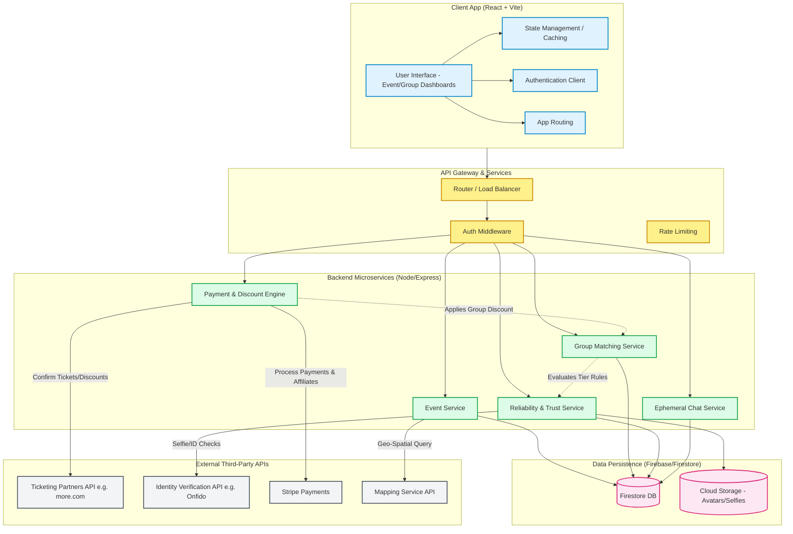

# System Architecture

## Overview
The architecture is designed to manage event discovery, secure group formation, strict role-based access control (Tiers), and integrations with external ticketing APIs.

### Client prototype (current repo)
See also `docs/PLATFORM_FEATURES.md` for the full feature roadmap (smart calendar, stories, trust).

The Vite app under `src/` runs **mock-first**: Zustand seeds users/events/groups; optional Ticketmaster merge uses ids prefixed `tm_` (see `src/lib/runtimeMode.ts`).

**Home (9 theme variants):** Each `Home*.tsx` keeps its hero/visual identity; shared behaviour lives in hooks and components:
- `useHomeExternalEvents()` — central Ticketmaster fetch
- `useStoryEvents()` — story rail ordering (seeking-host → trending → date)
- `useHomeEventFeed()` + `useHomeUrlFilters()` + `useHomeGeoDistance()` — filters, URL sync, radius with geolocation
- `HomeFiltersSection`, `HomeMobileFilterSheet`, `HomeThemedEnrichment`, `ActiveBuddiesRail`, `HomeQuickActions`, `HomeSearchDropdown` (recent + popular searches)
- `HomePersonalizationHint` + `HomeDiscoveryPrefsChips` — «Για Σένα» context from interests + `discoveryPrefs` (`homePersonalization.ts`)
- `useHomeScrollToFilters` + `#home-filters` — Categories shortcut scrolls; URL filter sync on back/forward
- `homeHeroMode` in store + Settings (`HomeHeroModeSetting`) and inline `HomeHeroModeBar`

**Calendar:** `MyCalendar.tsx` routes to theme wrappers; body is unified `MyCalendarPageContent` (day stories, hourly view, geometric cell thumbnails). Bulk export via `lib/calendarIcs.ts`; per-event via `lib/eventIcs.ts`.

See `docs/MERGE_INTEGRATION.md` for ZIP merge phase log.

**Event detail (7 theme variants):** Themed pages remain separate; shared logic includes `navigateBack()`, `useEventDetailActions()`, `EventDetailActionBar`, `EventDetailQrModal`, `downloadEventIcs()`, `EventDetailMetaSection`, `EventDetailMapSection`, `EventDetailAboutSection`, `EventDetailOrganizerSection`, `EventDetailGroupCard`. Tag/search deep links use `homeDeepLinks.ts`; participation rules use `eventParticipationRule.ts` + `trust.ts`.

**Stories & calendar:** `sortEventsForStories()` powers Home `EventStories` and calendar day taps; calendar reuses `StoryViewer` + `CalendarHourlySchedule`.

**Onboarding → Home:** `OnboardingClassic` (7 steps, local-only richness) redirects with URL filters; `HomeOnboardingWelcomeBanner` confirms tailoring. Full flow preserved; not replaced by ZIP 3-step onboarding.

**Event detail groups:** `EventDetailGroupCard` shared across themed pages (thin `Group` wrapper per theme file).

Dev-only scripts live in `scripts/`; legacy AI Studio repair tools in `app/applet/` are not part of the build. 

## Mermaid System Architecture Diagram

