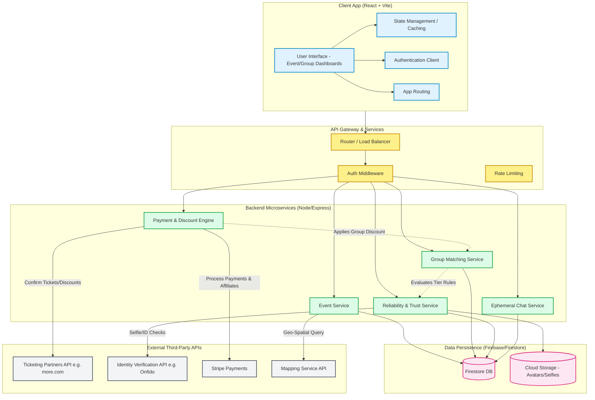

# System Architecture

## Overview
The architecture is designed to manage event discovery, secure group formation, strict role-based access control (Tiers), and integrations with external ticketing APIs. 

## Mermaid System Architecture Diagram

